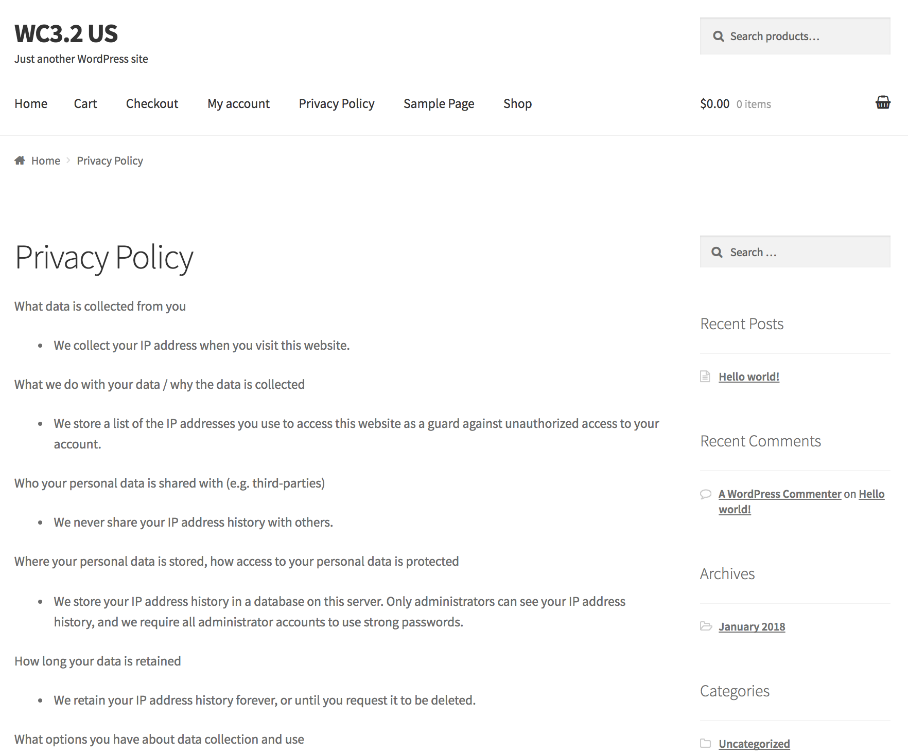

# wp-privacy-policy-shortcodes
Adds shortcodes through which plugins can expose their privacy policy statements in a consistent fashion.

Proposed Shortcodes

* What data is collected from the user [privacy-what-personal-data-collected]
* What we do with the data / why the data is collected [privacy-why-personal-data-collected]
* Who the data is shared with (e.g. third-parties) [privacy-sharing-personal-data]
* Where the data is stored, how access to the data is protected [privacy-storing-personal-data]
* How long data is retained [privacy-retaining-personal-data]
* What options the user may have about data collection and use [privacy-user-options-personal-data]
* How the user can access, update, or delete the collected data [privacy-user-managing-personal-data]

The site owner can then create a privacy policy page like this and have each plugin contribute its content automatically:

```
What data is collected from you
[privacy-what-personal-data-collected]

What we do with your data / why the data is collected
[privacy-why-personal-data-collected]

Who your personal data is shared with (e.g. third-parties)
[privacy-sharing-personal-data]

Where your personal data is stored, how access to your personal data is protected
[privacy-storing-personal-data]

How long your data is retained
[privacy-retaining-personal-data]

What options you have about data collection and use
[privacy-user-options-personal-data]

How you can access, update, or delete your collected data
[privacy-user-managing-personal-data]
```

It then looks like this on the front-side:



Note: Intention is to get this eventually into WordPress core, possibly via the https://github.com/GDPRWP/GDPRWP-Plugin project

See also related proof-of-concept plugin https://github.com/allendav/wp-user-ip-history
